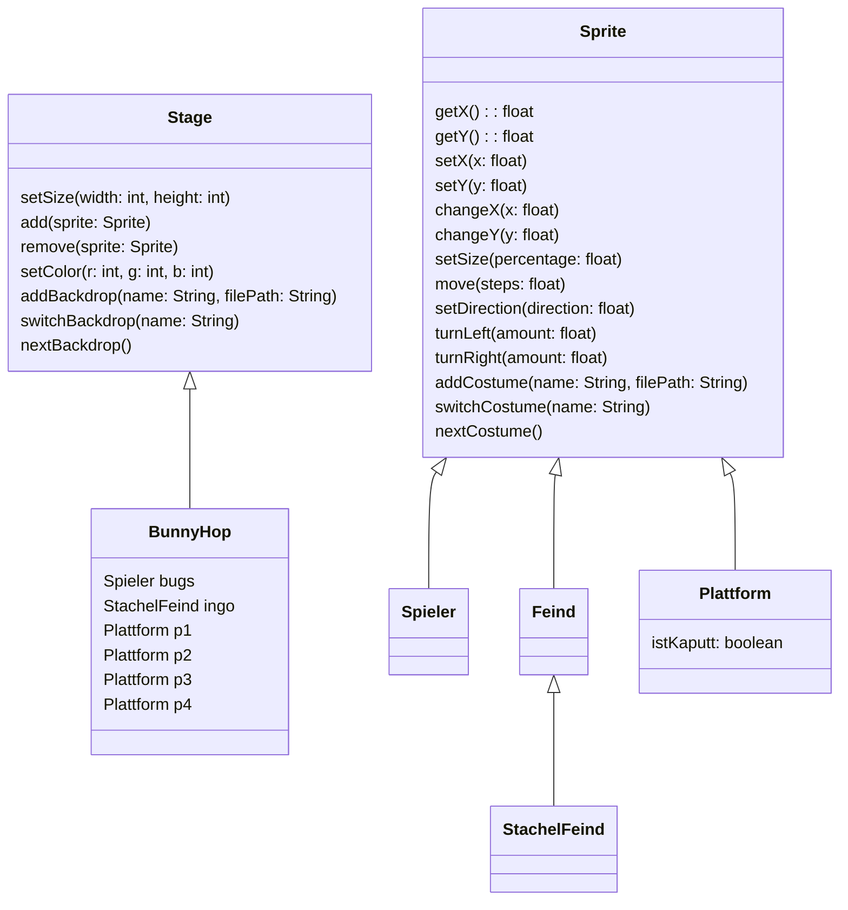

# Weitere Klassen

Unser Spiel besteht im Moment aus zwei Klassen. Im Laufe dieser Seite wollen wir weitere Klassen implementieren und die folgende Ausgabe erreichen.

## Aufgaben

### Klassen implementieren

Setze das folgende :t[UML-Klassendiagramm]{#klassendiagramm} im BlueJ-Projekt um. Die Klassen **Sprite** und **Stage** stammt aus der **Scratch for Java** Bibliothek. Die Klassen **Sprite** und **Stage** hat eine vielzahl von Methoden, die den Blöcken in Scratch ähneln. Wir werden diese nach und nach kennenlernen. Im Klassendiagramm werden nur im Moment relevante dargestellt, damit es übersichtlich bleibt.

:::alert{info}
Wenn du dir nicht sicher bist wie man das Klassendiagramm in Java umsetzen kann, dann orientiere dich an der Klasse Spieler oder schaue hier: :t[Verebung in Java]{#vererbung-java}
:::

### Ausgabe nachstellen

Da wir nun alle notwendigen Klassen zur Verfügung haben, können wir jetzt die Klasse **BunnyHop** so verändern, dass sie der obigen Ausgabe entspricht.

Modifiziere die Klasse **BunnyHop** so, dass sie der obigen Ausgabe entspricht.

:::collapsible{title="Tipp: Position" id="tipp-1"}
Mit den Methoden **setX** und **setY** kannst du die Position von Objekten der Klasse Sprite verändern.
:::

:::collapsible{title="Tipp: Koordinaten" id="tipp-2"}
Falls du Hilfe bzgl. der Koordinaten brauchst, kannst du im Konstruktor der **BunnyHop**-Klasse die Methode `this.setDebug(true)` aufrufen.
:::

:::collapsible{title="Tipp: Fenstergröße" id="tipp-3"}
Wenn du die Fenstergröße ändern möchtest, kannst du im Konstruktor der **BunnyHop**-Klasse die Methode `this.setSize(400, 200)` aufrufen.
:::
