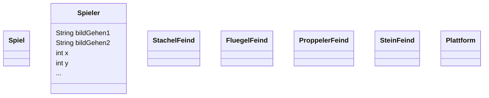

# Erstes Klassendiagramm

## Einführung

Bevor es mit der Programmierung eines Spiels losgehen kann, muss sich ein Entwickler:innenteam über die Grundidee ihres Spiels verständigen. 

Die Spielidee wird von den Entwickler:innen in einem beschreibenden Text festgehalten. Zusätzlich werden sogenannte Mockups angefertigt, die verschiedene Aspekte des Spiel grafisch darstellen.

In unserem Fall werden wir einen sogenannten **Endless Runner** entwickeln. Bekannte Spiele des Genres **Endless Runner** sind zum Beispiel "Template Run", "BIT.TRIP Runner", "Subway Surfers", "Doodle Jump" oder auch "Flappy Bird". Wir werden uns dabei auf ein 2D fokussieren.

, BIT.TRIP Runner (rechts)")

In dem Genre wird zwischen vertikalen und horizontalen Endless Runners unterschieden. Ihr werdet Spielmechaniken kennenlernen, sodass beide umgesetzt werden können.

## Die Spielidee

Ein Hase names Bugs soll automatisch von links nach rechts laufen. 

Dabei soll er auf einem Untergrund laufen, der ab und zu Lücken hat. 

Bugs kann in diese Lücken fallen und das Spiel ist verloren. Bugs kann springen, um über die Lücken zu kommen. Auf seinem Weg sollen Bugs verschiedene Feinde begegnen.

Die Feinde sollen sich unterschiedlich bewegen und wenn Bugs einen Feind berüht ist das Spiel verloren. Um sich gegen Feinde zu schützen kann Bugs eine Fähigkeit einsetzen, dafür muss er eine Karotte einsetzen. Karotten sollen im Verlauf des Spiels eingesammelt werden können.

Ziel des Spiels ist es so weit wie möglich nach rechts zu laufen.

### Mockup des Spiels

## Modellierung

### Klassendiagramm 

Um das Spiel umsetzen zu können, müssen zuerst alle :t[Objekte]{#objekt} und deren :t[Attribute]{#attribut} (Eigenschaften) und :t[Methoden]{#methode} (Fähigkeiten) identifiziert und entsprechende :t[Klassen]{#klasse} in einem :t[UML-Klassendiagramm]{#klassendiagramm} modelliert werden.

### Aufgabe

Das Team hat schon begonnen :t[Klassen]{#klasse} zu modellieren. Eure Aufgabe ist es das folgende :t[Klassendiagramm]{#klassendiagramm} zu vervollständigen.

 
Nutzt dazu die Vorlage im [Mermaid-Editor](https://mermaid.live/edit#pako:eNp9kU1vgzAMhv9K5DNCo51Ym_PUXidxq3LxiAvR8oFCkEoR_32BtqiaWH167fdx7CQDlE4ScCg1tu2nwsqjEVZYFmOusaJRpNlwK01xU-MKRX7BiuCVrdi30vJINdnsP2PzMJQN7PKc9OyRpWm6DH0aGbCsSR9IWbnMXeEOuqPqzk33WEG-vGuaaf9XUBGi-fIUjSGcnTd_t4EEDHmDSsaXnk0BoSZDAniUEv2PAGEnDrvgit6WwIPvKIGukRjo_jHAz6jbWG3QAh_gAjzPE-iBZ-95ut-95Ztsu_3Y7aMYE7g6F1uyGT_Nem4ffwEYd5ly).

:::alert{info}
Das aktuelle Diagramm wird in der URL gespeichert.
:::