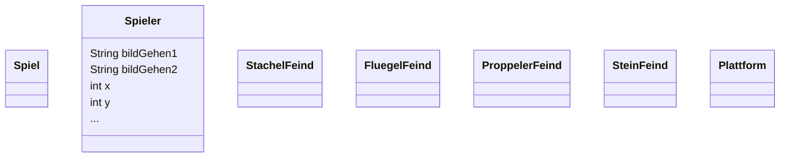

# Modellierung der Spielidee

Um die [Spielidee](/die-spielidee) umsetzen zu können, müssen zuerst alle :t[Objekte]{#objekt} und deren :t[Attribute]{#attribut} (Eigenschaften) und :t[Methoden]{#methode} (Fähigkeiten) identifiziert und entsprechende :t[Klassen]{#klasse} in einem :t[UML-Klassendiagramm]{#klassendiagramm} modelliert werden.

Das Team hat schon begonnen :t[Klassen]{#klasse} zu modellieren.

## Aufgaben

1. Vervollständig das :t[Klassendiagramm]{#klassendiagramm}. Nutzt dazu die Vorlage im [Mermaid-Editor](https://mermaid.live/edit#pako:eNp9kU1vgzAMhv9K5DNCo51Ym_PUXidxq3LxiAvR8oFCkEoR_32BtqiaWH167fdx7CQDlE4ScCg1tu2nwsqjEVZYFmOusaJRpNlwK01xU-MKRX7BiuCVrdi30vJINdnsP2PzMJQN7PKc9OyRpWm6DH0aGbCsSR9IWbnMXeEOuqPqzk33WEG-vGuaaf9XUBGi-fIUjSGcnTd_t4EEDHmDSsaXnk0BoSZDAniUEv2PAGEnDrvgit6WwIPvKIGukRjo_jHAz6jbWG3QAh_gAjzPE-iBZ-95ut-95Ztsu_3Y7aMYE7g6F1uyGT_Nem4ffwEYd5ly).
2. Identifiziert Gemeinsamkeiten der Klassen. Schreibt die Gemeinsamkeiten auf.
