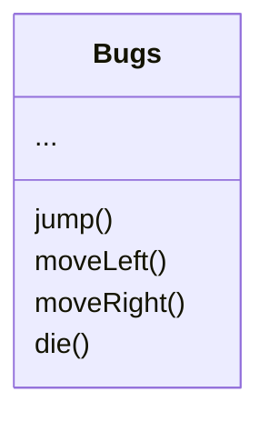

# Zustandsdiagramm für Bugs

Im Folgenden soll die Klasse Bugs durch das nachfolgende Klassendiagramm modelliert sein.

# Aufgabe

Erstellt einen Zustandsdiagram für das Spielobjekt Bugs. Benutzt dazu dieses [Excalidraw Vorlage](https://excalidraw.com/#json=F9VdGmBJQg4jZnhwVYmvv,9gxQV7ObbZ618ft5-wLW1A) und geht wie folgt vor:

- Bestimmt den Startzustand von Bugs und markiert diesen.
- Überlegt mit welchen Methoden Bugs aus dem Startzustand in einen anderen wechseln kann.
- Überlegt von nächsten Zuständen mit welchen Methoden Bugs in einen neuen Zustand wechseln kann.
- Überlegt welche Zustände Endzustände sein können und markiert diese.